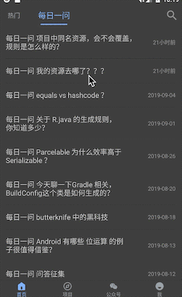

### 暗黑系WanAndroid客户端
首页适配掘金，简书，wanandroid 文章手机端显示
暗黑系列，保护双眼
适配wanandroid 每日一问，手机看答案，体验升级
适配简书文章，去广告，无需手动折叠打开
适配掘金文章，去header/footer，关注内容本身

### 项目架构
- 基于mvvm模式开发
- 网络层使用[LiveData+Retrofit](https://www.jianshu.com/p/34fb6ffaa684)，剔除RxJava
- 使用DataBinding展示数据，自定义属性，事件[CommonBinding](https://github.com/iamyours/Wandroid/blob/master/app/src/main/java/io/github/iamyours/wandroid/binds/CommonBinding.kt)，简化数据交互
- 自定义WebViewClient，适配简书，掘金，wanandroid手机端，注入css,js适配文章暗黑模式

### 效果

